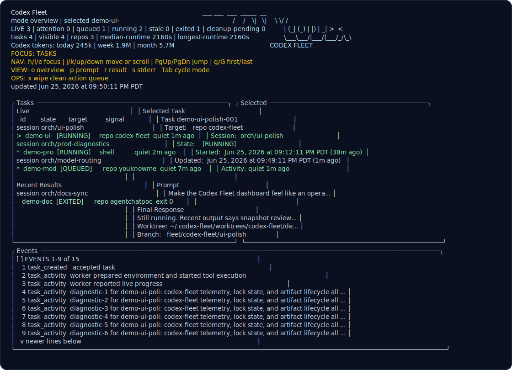

# codex-fleet

Codex Fleet is a local, single-operator orchestration layer for running multiple Codex workers from one orchestrator session. It keeps task state, worker output, worktrees, and cleanup outside the MCP connection so delegated work can survive client restarts.

This is a personal research tool, not a supported multi-user product. It works well for the workflow it was built for, but it intentionally runs powerful local agents. Read the safety model before using it on a machine with credentials or production access.



## What It Is

- A long-lived local daemon with durable task state and an authenticated Unix socket.
- A stateless MCP adapter for orchestrators.
- A CLI for inspection, service setup, and cleanup.
- A read-only terminal dashboard for live fleet visibility.
- A repo/shell task model that gives repo work isolated Fleet-owned worktrees.

The product behavior is described in [docs/DESIGN.md](docs/DESIGN.md). An implementation walkthrough is in [docs/CODE_WALKTHROUGH.md](docs/CODE_WALKTHROUGH.md).

## What It Is Not

- Not a sandbox for untrusted code.
- Not a multi-user or remote daemon.
- Not a general agent runtime; workers are Codex CLI processes today.
- Not a supported public service or package with compatibility guarantees.
- Not a semantic workflow engine. It reports operational facts; the orchestrator decides whether work is good enough.

## Safety Model

Workers run YOLO-style: `danger-full-access` and `approval-policy: never`. A worker can use the operator's GitHub credentials, SSH keys, Docker socket, local repos, and deploy scripts. This is the point of the tool, and also the risk.

The daemon is local-only by default and listens on a Unix socket under `~/.codex-fleet`. Access is gated by:

- filesystem permissions on `~/.codex-fleet`;
- per-client capability tokens;
- role-derived scopes for orchestrator, dashboard, and CLI clients.

This does not protect against code already running as the same OS user, root compromise, malicious repo code executed by a worker, or secrets printed by tools the worker runs. See [SECURITY.md](SECURITY.md) and [docs/v1-authn.md](docs/v1-authn.md).

## Status

This repository is published so readers can inspect the implementation behind the paper. It is suitable for local experimentation by people who are comfortable reading the code and accepting the broad-access worker model.

Known rough edges:

- Worker sandboxing and least-privilege access profiles are future work.
- Token rotation and same-user hardening are incomplete.
- Shell targets are broad host-access workers.
- macOS LaunchAgent support is the most exercised service path.
- The default backend is fake unless you explicitly enable real Codex workers.
- APIs and stored state may change without migration support.

## Concepts

- **Orchestrator**: the agent or MCP client the operator drives.
- **Daemon**: the durable local service that owns task state, events, workers, worktrees, and cleanup.
- **Task**: one delegated unit of work.
- **Worker**: one Codex process executing a task.
- **Session**: an orchestrator work context used to group tasks.

## Prerequisites

- [`mise`](https://mise.jdx.dev/) for pinned runtime setup.
- Bun from `mise install`; do not rely on an ambient `bun`.
- Git.
- A usable `codex` binary for real worker execution.
- Local toolchains for the repositories you delegate to.

## Install From Source

```sh
mise install
mise exec -- bun install
mise exec -- bun run deploy:local
```

Installed binaries are copied to `~/.local/bin`:

- `codex-fleet`
- `codex-fleet-daemon`
- `codex-fleet-mcp`
- `codex-fleet-tui`

## Client Tokens

Create local clients:

```sh
codex-fleet client init cli --role cli
codex-fleet client init dashboard --role dashboard
codex-fleet client init orchestrator --role orchestrator
```

Role summary:

- `orchestrator`: delegate, wait, inspect, and end tasks.
- `dashboard`: read-only visibility.
- `cli`: operator commands including cleanup and service actions.

Client tokens are written under `~/.codex-fleet/clients/<clientId>/token` with `0600` permissions.

## Run The Daemon

For real Codex workers, set the backend explicitly:

```sh
CODEX_FLEET_WORKER_BACKEND=codex \
CODEX_FLEET_CODEX_COMMAND=/path/to/codex \
codex-fleet daemon run
```

If `CODEX_FLEET_WORKER_BACKEND` is not set to `codex`, the daemon uses a fake worker backend. That is useful for tests and local UI development, but it will not run real delegated work.

On macOS, the LaunchAgent helper installs a user-level service:

```sh
codex-fleet service launch-agent install
codex-fleet service launch-agent load
codex-fleet service launch-agent status
```

After binary updates, use the same deterministic local deploy path:

```sh
mise exec -- bun run deploy:local
```

That command checks Fleet task state, builds and installs binaries, installs the
Fleet skill, restarts only the LaunchAgent daemon, and leaves client-owned MCP
adapter processes alone.

If you only need to restart the already-installed daemon:

```sh
codex-fleet service launch-agent restart
```

Do not kill or restart `codex-fleet-mcp` processes during a binary redeploy. The
MCP adapter is a stdio child owned by the MCP client; killing it closes the
client's active transport. Existing clients keep using the adapter process they
already launched until the client reconnects. If the updated adapter binary must
be used immediately, restart or reconnect the MCP client after the daemon is
healthy.

## Connect MCP

Point your MCP client at:

```sh
~/.local/bin/codex-fleet-mcp
```

Set the client identity:

```sh
CODEX_FLEET_CLIENT_ID=orchestrator
```

You may also pass the token directly:

```sh
CODEX_FLEET_TOKEN=<token-from-client-init>
```

Otherwise the adapter reads the token from `~/.codex-fleet/clients/<clientId>/token`.

Public MCP tools:

- `initialize`
- `list_targets`
- `delegate_task`
- `get_task`
- `wait_tasks`
- `list_tasks`
- `get_task_history`
- `end_task`

## Model Routing

`modelTier` is a cost/capability hint: `cheap`, `standard`, or `strong`.
`modelRoute` is optional concrete model selection. Omit `modelRoute` for
Fleet's default route, currently `gpt-5.6-terra`. Use explicit routes only when
the task justifies leaving that default:

- `gpt-5.5` for conservative fallback to the previous default family.
- `gpt-5.6-luna` for narrow, fast, lowest-cost GPT-5.6 work.
- `gpt-5.6-sol` for the hardest long-horizon, ambiguous, security-sensitive, or
  high-consequence work.

Task snapshots record `requestedModelRoute`, `actualModelRoute`, and
`workerModel` so operator review can detect whether orchestrators are
over-selecting Sol.

## Configure Repo Targets

Repo targets live in `~/.codex-fleet/repos.json`:

```json
{
  "repos": [
    {
      "alias": "example-app",
      "remoteUrl": "git@github.com:example/example-app.git",
      "defaultBranch": "main",
      "branchProtected": true,
      "mergePolicy": "human_review",
      "verifyCommands": ["mise run lint", "mise run test"],
      "defaultModelTier": "strong"
    }
  ]
}
```

Repo targets can also be imported from a GitHub repository catalog such as the
VPS ops OpenTofu catalog, with native Fleet entries used for overrides:

```json
{
  "githubRepositoryCatalogs": [
    {
      "path": "${CODEX_FLEET_AGENT_INFRA_ROOT}/vps-ops/config/github/repositories.json",
      "defaultModelTier": "strong"
    }
  ],
  "repos": [
    {
      "alias": "vps-ops",
      "verifyCommands": ["mise run required"]
    }
  ]
}
```

Imported catalog repos use the GitHub repository name as the Fleet alias and an
SSH remote URL rendered as `git@github.com:{owner}/{name}.git` by default.
Archived catalog repos are skipped unless the catalog import sets
`includeArchived` to `true`. Catalog paths support `~`, `$NAME`, and `${NAME}`
expansion, so machine-specific workspace locations can stay in environment
configuration instead of the registry file.

For each repo task, Fleet manages:

- a bare mirror under `~/.codex-fleet/repos/<alias>.git`;
- a task worktree under `~/.codex-fleet/worktrees/<alias>/<taskShort>`;
- a task branch such as `fleet/<alias>/<taskShort>` for mutating delivery modes.

Shell tasks run in Fleet-owned scratch directories under `~/.codex-fleet/shell/<taskShort>`.

`baseCheckout` exists as a compatibility mode for local development, but remote-backed mirrors are the preferred public shape.

`mergePolicy` is an instructional repo policy, not a credential boundary:

- `human_review`: workers may push branches and open/update ready PRs, then stop before merge.
- `agent_merge_explicit`: workers may merge only when the task prompt explicitly instructs that PR to be merged.
- `agent_merge_allowed`: workers may merge when the delivery mode, prompt, repo rules, and checks allow it.

If omitted, protected repos default to `human_review`; unprotected repos default to `agent_merge_explicit`.

## CLI And TUI

Common CLI commands:

```sh
codex-fleet list
codex-fleet status <taskId>
codex-fleet logs <taskId>
codex-fleet watch <taskId>
```

Cleanup:

```sh
codex-fleet cleanup list --dry-run
codex-fleet cleanup run --task <taskId>
codex-fleet cleanup run --task <taskId> --force
codex-fleet cleanup wipe-clean --dry-run
codex-fleet cleanup wipe-clean
```

Dashboard:

```sh
codex-fleet-tui
codex-fleet-tui --demo
codex-fleet-tui --once --demo --no-color
```

Keyboard controls:

- `j` / `k` or arrows: move selection.
- `g` / `G`: first / last visible task.
- `Tab`: cycle detail mode.
- `o`, `p`, `r`, `s`: overview, prompt, result, stderr.
- `x`: wipe action queue.
- `q`: quit.

## Validation

Preferred full check:

```sh
mise exec -- bun run check
```

Targeted checks:

```sh
mise exec -- bun run typecheck
mise exec -- bun run lint
mise exec -- bun run format:check
mise exec -- bun test
```

Optional real-Codex E2E:

```sh
mise exec -- bun run test:e2e:codex
```

## Repository Notes

- [docs/DESIGN.md](docs/DESIGN.md): source-of-truth design context.
- [docs/v1-authn.md](docs/v1-authn.md): current local authentication model.
- [docs/CODE_WALKTHROUGH.md](docs/CODE_WALKTHROUGH.md): implementation walkthrough.
- [AGENTS.md](AGENTS.md): instructions for agent contributors.
